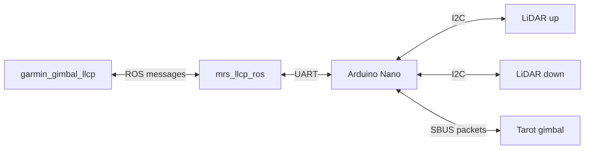

# MRS garmin LiDAR and Tarot gimbal LLCP driver
This nodelet utilizes [MRS LLCP protocol](https://github.com/ctu-mrs/mrs_llcp_ros) with arduino device to operate 2 garmin LiDAR Lite rangefinders and Tarot GoPro Hero 9 gimbal 


# Requirements
* The arduino should have the [firmware](https://github.com/ctu-mrs/mrs_garmin_and_gimbal_llcp/blob/main/firmware/garmin_gimbal_llcp.ino) installed. Don't forget to get the arduino LLCP library (see [documentation](https://github.com/ctu-mrs/mrs_llcp#using-llcp)).
* The LLCP mesages are defined in the attached [header files](https://github.com/ctu-mrs/mrs_garmin_and_gimbal_llcp/tree/main/firmware).
* Linked and compiled garmin_gimbal_llcp driver [nodelet](https://github.com/ctu-mrs/mrs_garmin_and_gimbal_llcp) in your [workspace](https://ctu-mrs.github.io/docs/system/preparing_for_a_real-world_experiment.html#set-up-your-own-workspace).
* Linked and compiled MRS LLCP [nodelet](https://github.com/ctu-mrs/mrs_llcp) in modules workspace.
* Correctly set  `.rules` file in `/etc/udev/rules.d`, the LED module portname is `arduino`
  * For example, on a T650 drone, with the LED module in 2nd module slot, the `99-usb-serial_T650_PCB.rules` file includes this line:
  ```bash
   SUBSYSTEM=="tty", ATTRS{idVendor}=="1a86", ATTRS{idProduct}=="7523", SYMLINK+="arduino",OWNER="mrs",MODE="0666"
  ```
  * Of course, the `OWNER` and `ENV{ID_USB_INTERFACE_NUM}` parameters have to correspond with your setup
* Wire connection between the onboard computer and arduino device

# How to run
When your workspace is built and sourced launch this file:
```bash
   roslaunch garmin_gimbal_llcp uav.launch
```
