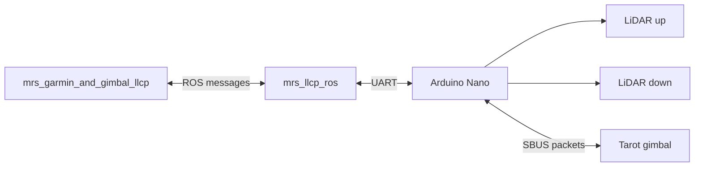

# MRS garmin LiDAR and Tarot gimbal LLCP controller
This nodelet utilizes MRS LLCP comunication with arduino device to control 2 garmin LiDAR Lite rangefinders and Tarot GoPro Hero 9 gimbal 

```mermaid
flowchart LR
A[mrs_garmin_and_gimbal_llcp] <-->|ROS messages| B[mrs_llcp_ros]
B <-->|UART| C[Arduino Nano]
C-->D[LiDAR up]
C-->E[LiDAR down]
C <-->|SBUS packets|F[Tarot gimbal]
```
